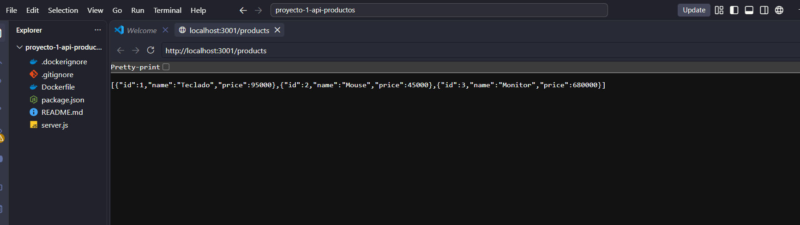
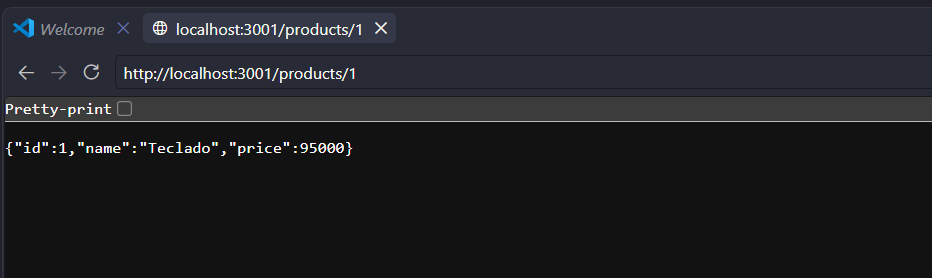
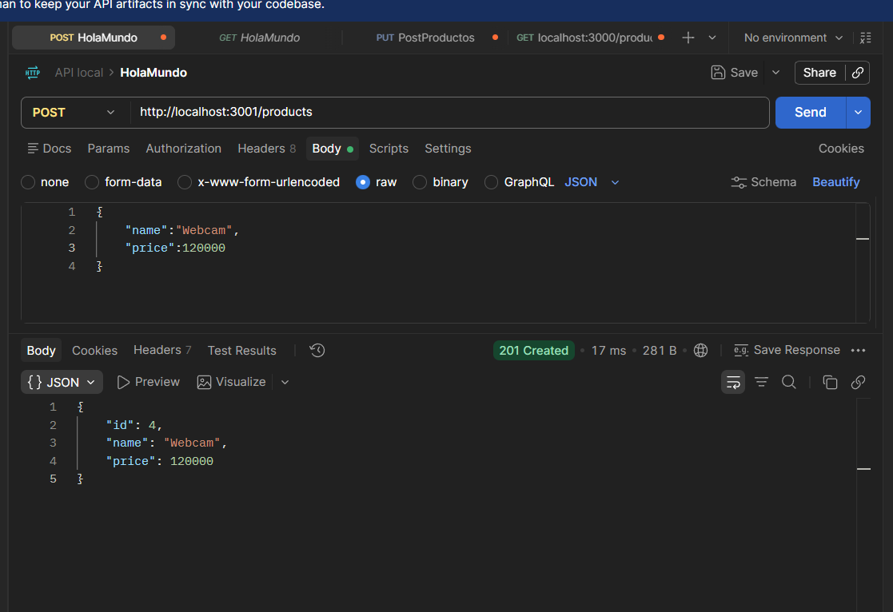
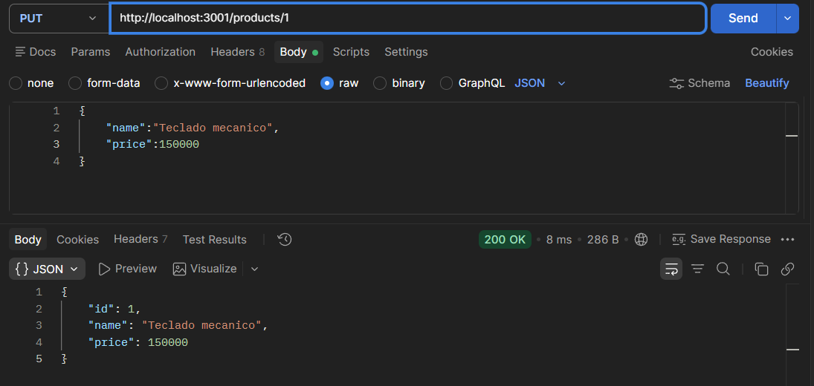
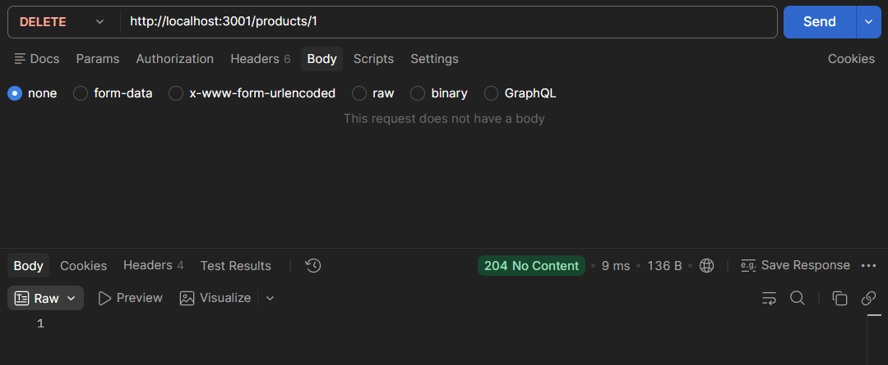

# Proyecto 1 - API REST de productos con Docker

API REST desarrollada con Node.js y Express. La aplicacion administra productos en memoria y se distribuye mediante una imagen Docker, por lo que puede ejecutarse sin instalar Node.js en el equipo anfitrion.

## Tecnologias

- Node.js 20
- Express
- Docker

## Estructura

```text
.
|- server.js            # API REST y datos en memoria
|- package.json         # Dependencias y comando de inicio
|- Dockerfile           # Definicion de la imagen Docker
|- .dockerignore        # Archivos excluidos de la imagen
`- evidencias/          # Pruebas funcionales realizadas
```

## Requisitos

- Docker Desktop instalado y en ejecucion.
- PowerShell o una terminal.

## Construccion y ejecucion

Desde la carpeta del proyecto, construir la imagen con nombre y version:

```powershell
docker build -t api-productos:1.0 .
```

Ejecutar el contenedor en segundo plano:

```powershell
docker run -d --name api-productos -p 3001:3000 api-productos:1.0
```

Se usa el puerto `3001` en la maquina porque el puerto `3000` estaba ocupado por otro contenedor. Dentro del contenedor la API permanece en el puerto `3000`.

Verificar el estado y los registros:

```powershell
docker ps
docker logs api-productos
```

Para detener y eliminar el contenedor:

```powershell
docker stop api-productos
docker rm api-productos
```

## Endpoints

| Metodo | Ruta | Descripcion | Respuesta esperada |
| --- | --- | --- | --- |
| GET | `/products` | Lista todos los productos. | `200 OK` |
| GET | `/products/:id` | Obtiene un producto por identificador. | `200 OK` o `404 Not Found` |
| POST | `/products` | Crea un producto. | `201 Created` |
| PUT | `/products/:id` | Actualiza un producto. | `200 OK` o `404 Not Found` |
| DELETE | `/products/:id` | Elimina un producto. | `204 No Content` o `404 Not Found` |

Ejemplos de pruebas desde PowerShell:

```powershell
curl http://localhost:3001/products
curl http://localhost:3001/products/1
```

```powershell
curl -Method POST http://localhost:3001/products `
  -ContentType "application/json" `
  -Body '{"name":"Webcam","price":120000}'
```

```powershell
curl -Method PUT http://localhost:3001/products/1 `
  -ContentType "application/json" `
  -Body '{"name":"Teclado mecanico","price":150000}'
```

```powershell
curl -Method DELETE http://localhost:3001/products/1
```

## Evidencias de funcionamiento

### Listar productos - GET `/products`

La API responde con los tres productos iniciales y sus precios.



### Consultar un producto - GET `/products/1`

La consulta devuelve el producto con identificador `1`.



### Crear un producto - POST `/products`

Se envio el producto `Webcam` con precio `120000`. La API respondio con `201 Created` y asigno el identificador `4`.



### Actualizar un producto - PUT `/products/1`

Se actualizo el producto `1` a `Teclado mecanico` con precio `150000`. La API respondio con `200 OK`.



### Eliminar un producto - DELETE `/products/1`

La eliminacion del producto `1` respondio con `204 No Content`, confirmando que la operacion fue exitosa.



## Conceptos de Docker aplicados

Una **imagen** es la plantilla inmutable construida con el `Dockerfile`; contiene la aplicacion, Node.js y sus dependencias. Un **contenedor** es la instancia en ejecucion creada desde esa imagen. El archivo `.dockerignore` evita copiar `node_modules` y archivos de Git a la imagen, reduciendo su contexto de construccion.
